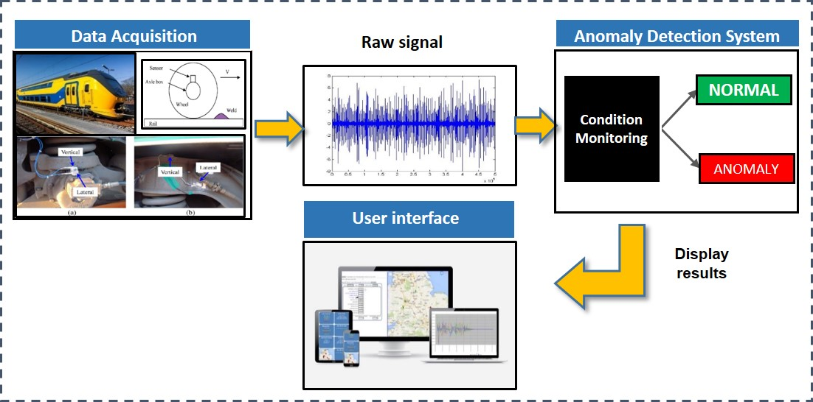

# RailAI

The repository contains code for defect identification and localization in railway infrastructure.

- The work can be cited using below citation information.

```
@phdthesis{ahmad2019artificial,
  title={Artificial intelligence based condition monitoring of rail infrastructure},
  author={Ahmad, Wasim},
  year={2019},
  school={University of Twente}
}
```

## Overview

We use axel box accelerometer data along with GPS information to identify and locate rail defects.
1. Preprocessing: Where we separate the data whether the test train is going forward or back. Also separated the data for left and right side of the track.
2. Then we apply anomaly detection technique to identify defect in data and localize it by using GPS information.
3. For evalulation, we obtain camera images for the entire track and couple it with the identified anomalies to see whether the anomalies in accelerometer data actually relate to defects on the track or not.


## Code
`/RailCMS.py` to run the project with user interface.

- `/data_processing.py` for the preprocessing of the axel box accelerometers data.
- `/extract_features.py` to estimate statistical features from the data which are used for further analysis.
- `/raildefects_main.py` to run the method from command prompt and analyse intermediate results.
- `/anomaly_detection.py` for identification and locating the position of defects in rail infrastructure.


<p align="center">

</p>


## Data
We use axel box accelermeters data, railway images dataset obtained from ProRail. 


## Dependencies
The file `requirements.txt` contains all the packages that are related to the project.
To install them, simply create a new [conda](https://docs.conda.io/en/latest/) environment and type
```
pip install -r requirements.txt
```

