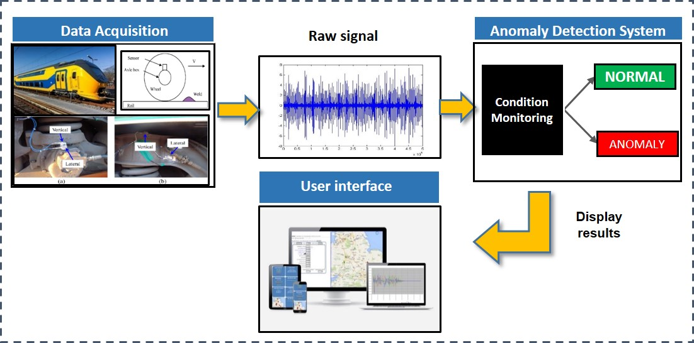

# RailAI — rail defect detection from axle-box acceleration

Code from the PhD thesis *Artificial intelligence based condition monitoring of rail infrastructure* (University of Twente, 2019), developed with Strukton Rail.

Axle-box accelerometer (ABA) recordings and GPS/route files are used to find and locate rail defects. Isolation Forest scores sliding-window features; kilometre positions come from the SEG/POI route files.

```bibtex
@phdthesis{ahmad2019artificial,
  title={Artificial intelligence based condition monitoring of rail infrastructure},
  author={Ahmad, Wasim},
  year={2019},
  school={University of Twente}
}
```

## Method

1. **Pre-processing** — read the ABA HDF5 file, align internal/external counters, tag travel direction (push/pull) and left/right rail, and replace switch locations with channel means.
2. **Features** — RMS, kurtosis, crest factor, impulse factor, skewness, peak-to-peak (and others) on a sliding window.
3. **Detection** — Isolation Forest on the chosen features; anomaly scores are min-max normalised.
4. **Localization** — map anomaly counters to track kilometres via the SEG file; optional camera overlay for visual checks.

<p align="center">

</p>

## Layout

| File | Role |
| --- | --- |
| `RailCMS.py` | PyQt5 desktop UI |
| `raildefects_main.py` | `RailDefects` pipeline (CLI / library) |
| `data_processing.py` | ABA + route-file pre-processing |
| `extract_features.py` | sliding-window statistics |
| `anomaly_detection.py` | Isolation Forest |
| `compare_anomaly.py` | CHA/CHB matching and kilometre mapping |
| `data_paths.py` | default Groningen measurement paths |
| `spot_anomaly.py` | overlay detections on track images |
| `performance.py` | hit / false-alarm counts vs labelled XML |
| `severity_analysis.py` | ABA score vs eddy-current crack depth |

## Installation

```bash
conda create -n railai python=3.8
conda activate railai
pip install -r requirements.txt
```

Measurement files (HDF5 ABA, SEG/POI CSVs) are not in this repository. Point the code at your local copy:

```bash
export STRUKTON_DATA_ROOT=/path/to/Groningen
export STRUKTON_COUNTERS=/path/to/counter_data
```

If those variables are unset, the original Windows thesis paths under `F:\UTDATA3OCT\...` are used.

## Run

Desktop UI:

```bash
python RailCMS.py
```

Command line (uses `data_paths` / the environment variables above):

```bash
python raildefects_main.py
```

In Python:

```python
from raildefects_main import RailDefects
from data_paths import data_paths

paths = data_paths()
model = RailDefects(1)
result = model.anomaly_detection(
    pprocessed_file=paths.processed_file,
    seg_file=paths.seg_file,
    features="RMS",
    sliding_window=2000,
    sub_sampling=128,
    impurity=0.025,
    num_trees=100,
)
```

`result` is an array of `[position_km, counter, severity]` rows, sorted by position.

## Data

ABA, route files, and track images were provided by ProRail. Eddy-current / ultrasonic scripts (`ectdata.py`, `ustdata.py`) expect the corresponding Excel exports on disk.

## Acknowledgement

This work was funded jointly with the University of Twente (Applied Maintenance Group) and Strukton Rail.
