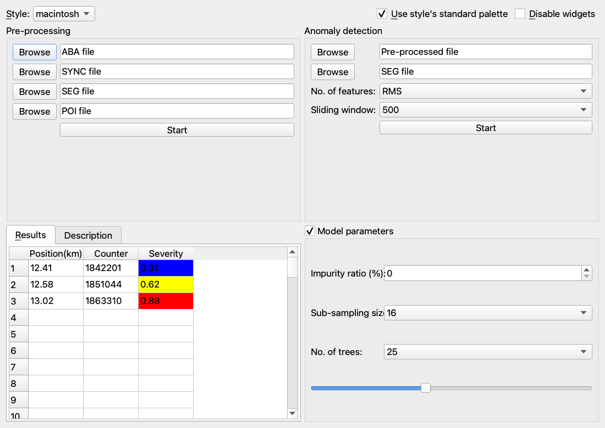

# RailAI — rail defect detection from axle-box acceleration

Code from the Engineering Doctorate thesis *Artificial intelligence based condition monitoring of rail infrastructure* (University of Twente, 2019), developed with Strukton Rail.

Axle-box accelerometer (ABA) recordings and GPS/route files are used to find and locate rail defects. Isolation Forest scores sliding-window features; kilometre positions come from the SEG/POI route files.

```bibtex
@phdthesis{ahmad2019artificial,
  title={Artificial intelligence based condition monitoring of rail infrastructure},
  author={Ahmad, Wasim},
  year={2019},
  school={University of Twente}
}
```

## Method

1. **Pre-processing** — read the ABA HDF5 file, align internal/external counters, tag travel direction (push/pull) and left/right rail, and replace switch locations with channel means.
2. **Features** — RMS, kurtosis, crest factor, impulse factor, skewness, peak-to-peak (and others) on a sliding window.
3. **Detection** — Isolation Forest on the chosen features; anomaly scores are min-max normalised.
4. **Localization** — map anomaly counters to track kilometres via the SEG file; optional camera overlay for visual checks.

<p align="center">

</p>

The desktop UI (`python RailCMS.py`) loads ABA / route files, runs detection, and lists kilometre position, counter, and severity (blue / yellow / red). The rows in the screenshot are example detections so the Results table is visible.

<p align="center">

</p>

## Layout

```
strukton_project/
├── railai/                 core library
│   ├── pipeline.py         RailDefects (train / detect / localise)
│   ├── preprocessing.py    ABA + SEG/POI alignment
│   ├── features.py         sliding-window statistics
│   ├── detection.py        Isolation Forest
│   ├── matching.py         CHA/CHB kilometre mapping
│   ├── paths.py            measurement locations
│   └── io_utils.py         route-file readers
├── ui/                     PyQt5 desktop app
├── scripts/                camera overlay, scoring, ECT/UST plots
├── data/                   put local measurements here (not in git)
├── figures/                maps and plots written at runtime
└── res/                    thesis figures used in this README
```

Root launchers `RailCMS.py` and `raildefects_main.py` still work.

## Installation

```bash
conda create -n railai python=3.8
conda activate railai
pip install -r requirements.txt
```

Measurement files are not in this repository. Point the code at your local copy (see `data/README.md`):

```bash
export STRUKTON_DATA_ROOT=/path/to/Groningen
export STRUKTON_COUNTERS=/path/to/counter_data
```

If those variables are unset, the original Windows thesis paths under `F:\UTDATA3OCT\...` are used.

## Run

Desktop UI (same as before):

```bash
python RailCMS.py
```

Command-line pipeline:

```bash
python raildefects_main.py
```

Or as a module:

```bash
python -m railai          # detection
python -m railai gui      # UI
```

In Python:

```python
from railai import RailDefects, data_paths

paths = data_paths()
model = RailDefects(1)
result = model.anomaly_detection(
    pprocessed_file=paths.processed_file,
    seg_file=paths.seg_file,
    features="RMS",
    sliding_window=2000,
    sub_sampling=128,
    impurity=0.025,
    num_trees=100,
)
```

`result` is an array of `[position_km, counter, severity]` rows, sorted by position.

## Data

ABA, route files, and track images were provided by ProRail. Extra scripts under `scripts/` expect the corresponding Excel / image exports on disk.

## Acknowledgement

This work was funded jointly with the University of Twente (Applied Maintenance Group) and Strukton Rail.
